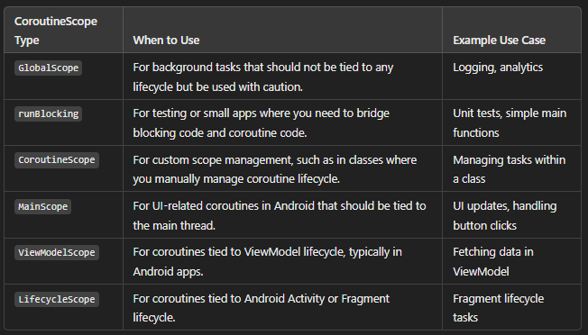

### Q1: What are coroutines in Kotlin? ☆☆☆

**Answer:**
Unlike many other languages with similar capabilities, async and await are not keywords in Kotlin and are not even part of its standard library. 

`kotlinx.coroutines` is a rich library for coroutines developed by JetBrains. It contains a number of high-level coroutine-enabled primitives, including `launch`, `async` and others. Kotlin Coroutines give you an API to write your asynchronous code sequentially. 

The documentation says Kotlin Coroutines are like lightweight threads. They are lightweight because creating coroutines doesn’t allocate new threads. Instead, they use predefined thread pools, and smart scheduling. Scheduling is the process of determining which piece of work you will execute next.

Additionally, coroutines can be **suspended** and **resumed** mid-execution. This means you can have a long-running task, which you can execute little-by-little. You can pause it any number of times, and resume it when you’re ready again. 

### Q2. What are Kotlin coroutines?
Kotlin coroutines are a lightweight concurrency framework that allows you to write asynchronous code in a more sequential and readable manner. They allow you to execute potentially blocking code without actually blocking threads, improving efficiency and reducing callback complexity.

### Q3. What is the difference between launch and async in Kotlin coroutines?

`launch`: Used to start a coroutine that does not return a result. It launches a job and is mainly used when no result is expected from the coroutine.
`async`: Used to start a coroutine that returns a result. It returns a Deferred<T>, which can be awaited to get the result of the coroutine.

### Q4. What is the role of suspend keyword in Kotlin?

The suspend keyword marks a function as suspendable, meaning it can be paused and resumed at a later time. These functions can be called from coroutines and other suspend functions. They allow non-blocking execution of long-running tasks.

### Q5. Explain the concept of Coroutine Builders in Kotlin.
Coroutine Builders are functions that are used to create and start coroutines. Examples include launch, async, and runBlocking. They provide a convenient way to initiate and control the execution of coroutines.

### Q6: How do you achieve `parallelism` using Kotlin Coroutines?
`Parallelism` in coroutines can be achieved using the `async` builder along with `await` to `await` the results. Multiple asynchronous tasks can be started concurrently, and their results can be combined when needed.

### Q7.  What is a CoroutineScope? Why is it important?
Answer:
`CoroutineScope` defines the lifecycle of coroutines. It provides context, such as the dispatcher and job, to coroutines. It's important because it helps manage coroutines' lifecycle by ensuring that all coroutines launched within the scope are properly structured and canceled when needed.

### Q8.  What is Job in Kotlin Coroutines? How do you cancel a job?
Answer:
Job is a handle to a coroutine's lifecycle. It represents the coroutine’s lifecycle and can be used to control it (like starting, canceling). You can cancel a job by calling the cancel() function on the job instance, which terminates the coroutine.


### Q9. What is the difference between Dispatchers.IO, Dispatchers.Default, and Dispatchers.Main?
Answer:

`Dispatchers.IO`: Optimized for offloading blocking I/O operations (e.g., network or file operations).

`Dispatchers.Default`: Optimized for CPU-intensive tasks (e.g., sorting a large dataset, computations).

`Dispatchers.Main`: Used for tasks that need to run on the main (UI) thread, usually for updating the UI.

### Q10. What is structured concurrency in Kotlin coroutines?
Answer:
Structured concurrency ensures that all coroutines launched within a specific scope are properly managed and completed before the scope is exited. This avoids leaks and ensures that the coroutines are controlled by a parent-child hierarchy, where the parent coroutine waits for all its child coroutines to complete before completing itself.

### Q11. What is the difference between runBlocking and coroutineScope?
Answer:

`runBlocking`: Blocks the current thread until the coroutine inside it completes. It is often used in test cases or for starting coroutines in a non-coroutine environment.
`coroutineScope`: Does not block the current thread. It creates a new coroutine scope and suspends execution until all coroutines launched inside it are completed.

### Q12.  Explain the concept of withContext in coroutines.
withContext is used to change the context (usually the dispatcher) of a coroutine while keeping the sequential execution of code. It switches the coroutine's execution context to a different dispatcher (e.g., from Dispatchers.Main to Dispatchers.IO for I/O tasks) and returns the result of the execution.

### Q13. What is a SupervisorJob and how does it differ from a regular Job?
Answer:
A SupervisorJob is a type of job that ensures child coroutines do not cancel the parent or other sibling coroutines if they fail. In a regular Job, failure of a child coroutine cancels the entire coroutine scope, including the parent and all its children.

### Q14. How can you handle exceptions in Kotlin coroutines?
Answer:
You can handle exceptions in Kotlin coroutines using:

try-catch within a coroutine to catch specific exceptions.
`CoroutineExceptionHandler` to handle uncaught exceptions at the coroutine scope level.
Structured concurrency ensures that if a coroutine fails, its parent and siblings can handle or cancel appropriately based on their structure (e.g., using SupervisorJob).

### Q15: What is the difference between suspending vs. blocking? ☆☆☆

**Answer:**
* A **blocking** call to a function means that a call to any other function, from the same thread, will halt the parent’s execution. Following up, this means that if you make a blocking call on the main thread’s execution, you effectively freeze the UI. Until that blocking calls finishes, the user will see a static screen, which is not a good thing.

* **Suspending** doesn’t necessarily block your parent function’s execution. If you call a suspending function in some thread, you can easily push that function to a different thread. In case it is a heavy operation, it won’t block the main thread. If the suspending function has to suspend, it will simply pause its execution. This way you free up its thread for other work. Once it’s done suspending, it will get the next free thread from the pool, to finish its work.

### Q16: What is suspending function in Kotlin? ☆☆☆

**Answer:**
A **suspending function** is just a regular Kotlin function with an additional suspend modifier which indicates that the function can suspend the execution of a coroutine without blocking the current thread. This means that the code you are looking at might stop executing at the moment it calls a suspending function, and will resume at some later time. However, it doesn’t say anything about what the current thread will do in the meantime.

Suspending functions can invoke any other regular functions, but to actually suspend the execution, it has to be another suspending function.A suspending function cannot be invoked from a regular function, therefore several so-called coroutine builders are provided, which allow calling a suspending function from a regular non-suspending scope like `launch`, `async`, `runBlocking`.

### Q17: What is Coroutine Scope and how is that different from Coroutine Context? ☆☆☆☆

**Answer:**
* Coroutines always execute in some context represented by a value of the **CoroutineContext** type, defined in the Kotlin standard library. The coroutine context is a set of various elements. The main elements are the **Job** of the coroutine.

* **CoroutineScope** has no data on its own, it just holds a **CoroutineContext**. Its key role is as the implicit receiver of the block you pass to `launch`, `async` etc.

 ```kotlin
runBlocking {
    val scope0 = this
    // scope0 is the top-level coroutine scope.
    scope0.launch {
        val scope1 = this
        // scope1 inherits its context from scope0. It replaces the Job field
        // with its own job, which is a child of the job in scope0.
        // It retains the Dispatcher field so the launched coroutine uses
        // the dispatcher created by runBlocking.
        scope1.launch {
            val scope2 = this
            // scope2 inherits from scope1
        }
    }
}
```
You might say that **CoroutineScope** formalizes the way the **CoroutineContext** is inherited. You can see how the **CoroutineScope** mediates the inheritance of coroutine contexts. If you cancel the job in `scope1`, this will propagate to `scope2` and will cancel the launched job as well.


### Q18. Types of CoroutineScope with examples and when should use which coroutinesScope?
In Kotlin, CoroutineScope is an interface that manages the lifecycle of coroutines. Different types of CoroutineScopes are available depending on the use case and the need for structured concurrency. Here are the key types of CoroutineScopes and their examples, along with guidance on when to use each one:

1. GlobalScope
* GlobalScope is a global coroutine scope that is not tied to any specific lifecycle. It lives throughout the application's lifetime and should be used carefully to avoid memory leaks.
* Use GlobalScope for background tasks that should run independently of the app's lifecycle, such as logging, analytics, or tasks that should continue running regardless of the lifecycle of the UI or component.
```Java
fun main() {
    GlobalScope.launch {
        delay(1000)
        println("Running in GlobalScope")
    }
    Thread.sleep(2000)  // To keep the JVM alive for coroutine execution
}
```
* Caution: Avoid using GlobalScope in Android apps or applications with component lifecycles, as it can lead to memory leaks or running coroutines even after the app/component is destroyed.

2. runBlocking

* runBlocking is a coroutine builder that bridges between regular code and coroutine code by blocking the current thread until all coroutines inside it complete.
* Use runBlocking in unit tests or main functions where you want to call suspending functions from a non-suspending context. It is often used for testing or in small standalone applications, but avoid using it in production code, especially on Android's main thread, as it blocks the thread.
```Java
fun main() = runBlocking {
    launch {
        delay(1000)
        println("Running in runBlocking")
    }
    println("Coroutine is launched")
}
```
*  This blocks the thread, so using it in a UI thread or on the Android main thread can cause the UI to freeze.

3. CoroutineScope (Custom Scope)
* CoroutineScope allows you to create custom scopes for managing coroutines based on your use case, often tied to specific components, objects, or lifecycle events
* Use CoroutineScope when you need structured concurrency in a specific part of your code, such as a ViewModel in Android or a long-running background task. The lifecycle of the coroutines will be tied to the object implementing this scope, ensuring proper cleanup of coroutines.
```Java
class MyCustomScope : CoroutineScope {
    private val job = Job()
    override val coroutineContext = Dispatchers.Default + job

    fun startTask() {
        launch {
            delay(1000)
            println("Task running in custom CoroutineScope")
        }
    }

    fun cleanup() {
        job.cancel()  // Cancel all coroutines when no longer needed
    }
}

fun main() {
    val myScope = MyCustomScope()
    myScope.startTask()
    Thread.sleep(2000)
    myScope.cleanup()
}
```
* This is useful when you want to tie coroutine lifecycle to a specific object or lifecycle (e.g., ViewModel in Android) and manage the job manually.

4. MainScope
* MainScope is typically used in Android development and automatically uses Dispatchers.Main as the context for its coroutines. This scope is useful for UI-related tasks as it uses the main thread.
* Use MainScope for UI-related tasks that need to be tied to an Android activity or fragment's lifecycle. It's commonly used for launching coroutines that update the UI.
```Java
class MyActivity : CoroutineScope by MainScope() {
    fun startTask() {
        launch {
            delay(1000)
            println("Task running on Main Thread")
        }
    }

    fun onDestroy() {
        cancel()  // Cancel all coroutines tied to this scope
    }
}
```

*  This is useful in Android development, where coroutines need to be tied to the UI lifecycle, such as in Activities or Fragments.

5. ViewModelScope (Android)
* ViewModelScope is provided by the Android Jetpack library and is tied to the lifecycle of the ViewModel. When the ViewModel is cleared, all coroutines started in this scope are canceled.
* Use ViewModelScope for UI-related coroutines that need to survive configuration changes but be canceled when the ViewModel is cleared, such as loading data in the background or handling long-running tasks.
```Java
class MyViewModel : ViewModel() {
    fun fetchData() {
        viewModelScope.launch {
            delay(1000)
            println("Task running in ViewModelScope")
        }
    }
}
```
* This is best for managing coroutines in ViewModel, especially for background tasks like fetching data or handling UI-related logic.


In Kotlin, CoroutineScope is an interface that manages the lifecycle of coroutines. Different types of CoroutineScopes are available depending on the use case and the need for structured concurrency. Here are the key types of CoroutineScopes and their examples, along with guidance on when to use each one:

1. GlobalScope
Description:

GlobalScope is a global coroutine scope that is not tied to any specific lifecycle. It lives throughout the application's lifetime and should be used carefully to avoid memory leaks.
When to Use:

Use GlobalScope for background tasks that should run independently of the app's lifecycle, such as logging, analytics, or tasks that should continue running regardless of the lifecycle of the UI or component.
Example:

kotlin
Copy code
import kotlinx.coroutines.*

fun main() {
    GlobalScope.launch {
        delay(1000)
        println("Running in GlobalScope")
    }
    Thread.sleep(2000)  // To keep the JVM alive for coroutine execution
}
Caution: Avoid using GlobalScope in Android apps or applications with component lifecycles, as it can lead to memory leaks or running coroutines even after the app/component is destroyed.

2. runBlocking
Description:

runBlocking is a coroutine builder that bridges between regular code and coroutine code by blocking the current thread until all coroutines inside it complete.
When to Use:

Use runBlocking in unit tests or main functions where you want to call suspending functions from a non-suspending context. It is often used for testing or in small standalone applications, but avoid using it in production code, especially on Android's main thread, as it blocks the thread.
Example:

kotlin
Copy code
import kotlinx.coroutines.*

fun main() = runBlocking {
    launch {
        delay(1000)
        println("Running in runBlocking")
    }
    println("Coroutine is launched")
}
Caution: This blocks the thread, so using it in a UI thread or on the Android main thread can cause the UI to freeze.

3. CoroutineScope (Custom Scope)
Description:

CoroutineScope allows you to create custom scopes for managing coroutines based on your use case, often tied to specific components, objects, or lifecycle events.
When to Use:

Use CoroutineScope when you need structured concurrency in a specific part of your code, such as a ViewModel in Android or a long-running background task. The lifecycle of the coroutines will be tied to the object implementing this scope, ensuring proper cleanup of coroutines.
Example:

kotlin
Copy code
import kotlinx.coroutines.*

class MyCustomScope : CoroutineScope {
    private val job = Job()
    override val coroutineContext = Dispatchers.Default + job

    fun startTask() {
        launch {
            delay(1000)
            println("Task running in custom CoroutineScope")
        }
    }

    fun cleanup() {
        job.cancel()  // Cancel all coroutines when no longer needed
    }
}

fun main() {
    val myScope = MyCustomScope()
    myScope.startTask()
    Thread.sleep(2000)
    myScope.cleanup()
}
Use Case: This is useful when you want to tie coroutine lifecycle to a specific object or lifecycle (e.g., ViewModel in Android) and manage the job manually.

4. MainScope
Description:

MainScope is typically used in Android development and automatically uses Dispatchers.Main as the context for its coroutines. This scope is useful for UI-related tasks as it uses the main thread.
When to Use:

Use MainScope for UI-related tasks that need to be tied to an Android activity or fragment's lifecycle. It's commonly used for launching coroutines that update the UI.
Example:

kotlin
Copy code
import kotlinx.coroutines.*

class MyActivity : CoroutineScope by MainScope() {
    fun startTask() {
        launch {
            delay(1000)
            println("Task running on Main Thread")
        }
    }

    fun onDestroy() {
        cancel()  // Cancel all coroutines tied to this scope
    }
}
Use Case: This is useful in Android development, where coroutines need to be tied to the UI lifecycle, such as in Activities or Fragments.

5. ViewModelScope (Android)
Description:

ViewModelScope is provided by the Android Jetpack library and is tied to the lifecycle of the ViewModel. When the ViewModel is cleared, all coroutines started in this scope are canceled.
When to Use:

Use ViewModelScope for UI-related coroutines that need to survive configuration changes but be canceled when the ViewModel is cleared, such as loading data in the background or handling long-running tasks.
Example:

kotlin
Copy code
import androidx.lifecycle.ViewModel
import androidx.lifecycle.viewModelScope
import kotlinx.coroutines.launch

class MyViewModel : ViewModel() {
    fun fetchData() {
        viewModelScope.launch {
            delay(1000)
            println("Task running in ViewModelScope")
        }
    }
}
Use Case: This is best for managing coroutines in ViewModel, especially for background tasks like fetching data or handling UI-related logic.

6. LifecycleScope (Android)

* LifecycleScope is an Android-specific scope tied to a LifecycleOwner (like an Activity or Fragment). Coroutines in this scope are automatically canceled when the lifecycle reaches a certain state.

* Use LifecycleScope in Activities or Fragments for coroutines that should be canceled when the lifecycle reaches a specific state (e.g., when the activity is destroyed).
```Java
class MyFragment : Fragment() {
    fun startTask() {
        lifecycleScope.launch {
            delay(1000)
            println("Task running in LifecycleScope")
        }
    }
}
```

* Best for tying coroutines to the Android lifecycle, such as in Fragments or Activities, to ensure they are automatically canceled when no longer needed.

