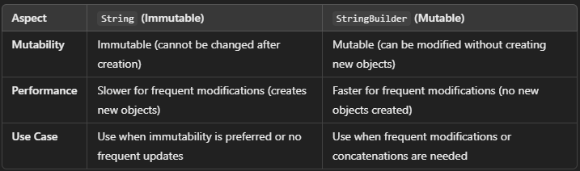

### How do you create a multiline string in Kotlin?

 ```kotlin
 val multiLineString = """
    This is a 
    multiline string.
"""
```

### How do you concatenate strings in Kotlin

The best way of string concatenation is String Interpolation in Kotlin

### How do you perform type conversion from a string to an integer in Kotlin?

```
val str = "123"
val number = str.toInt()
```

###  What will happen if you try to convert a non-numeric string to an integer?

 Answer: It will throw a `NumberFormatException`. To handle this safely, use .`toIntOrNull()` which returns null if the conversion fails

 ```kotlin
 val str = "abc"
val number = str.toIntOrNull() 
```

### How do you check if a number is even or odd in Kotlin?

```Kotlin
val number = 4
val isEven = number % 2 == 0
println(isEven)  // Output: true
```

### What are nullable types in Kotlin?

Answer: In Kotlin, types are non-nullable by default. If you want to allow a variable to hold a null value, you must explicitly mark it as nullable using a ? after the type

###  What are the basic data types available in Kotlin?

 Answer: The basic data types in Kotlin are:
Int for integers
Double for floating-point numbers
Float for floating-point numbers
Long for large integers
Boolean for true/false values
Char for a single character
String for a sequence of characters

### How do you declare and use arrays in Kotlin?

```Kotlin
val numbers = arrayOf(1, 2, 3, 4)
println(numbers[0])  // Output: 1
```


### What is the difference between String and String builder

A String in Kotlin is immutable, meaning once it's created, its value cannot be changed. If you modify a String, a new String object is created, and the old one is discarded (if not referenced elsewhere).

StringBuilder, on the other hand, is mutable, meaning you can modify its contents without creating new objects. You can append, insert, delete, or modify characters efficiently
